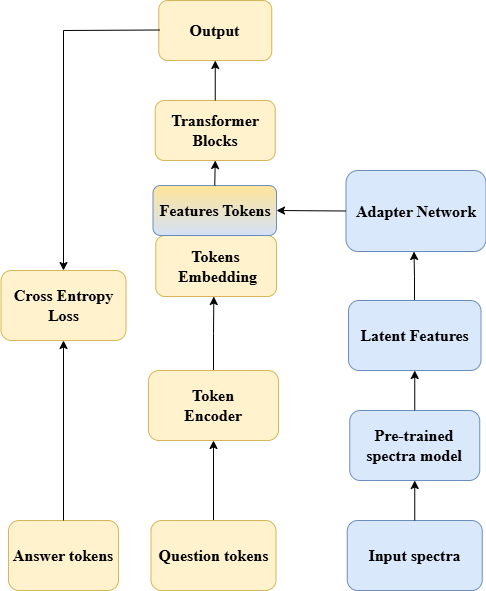

# TalkingLatents: Converting LLMs into Astronomers

.pdf)

**TalkingLatents** is a framework for aligning scientific foundation models with large language models (LLMs), enabling natural language interfaces to complex scientific latent spaces. Using stellar astrophysics as a case study, we demonstrate how LLMs can effectively reason over high-dimensional physical data and perform multiple downstream tasks through simple text prompts.

## Overview

This repository implements **LatentInterpreter (LI)**, a multimodal architecture that fuses pre-trained spectral features with language models through a lightweight adapter network and LoRA fine-tuning. The key innovation is treating latent physical features as effective tokens in the LLM's embedding space, enabling:

- **Natural language reasoning** over complex scientific data
- **Zero-shot inference** on unseen physical tasks
- **Controllable steering** along physically meaningful directions
- **Interpretability** of scientific latent spaces

## Architecture

The framework combines a pre-trained spectral model (blue) with a language model (yellow) through an Adapter Network that projects latent features into effective tokens.

